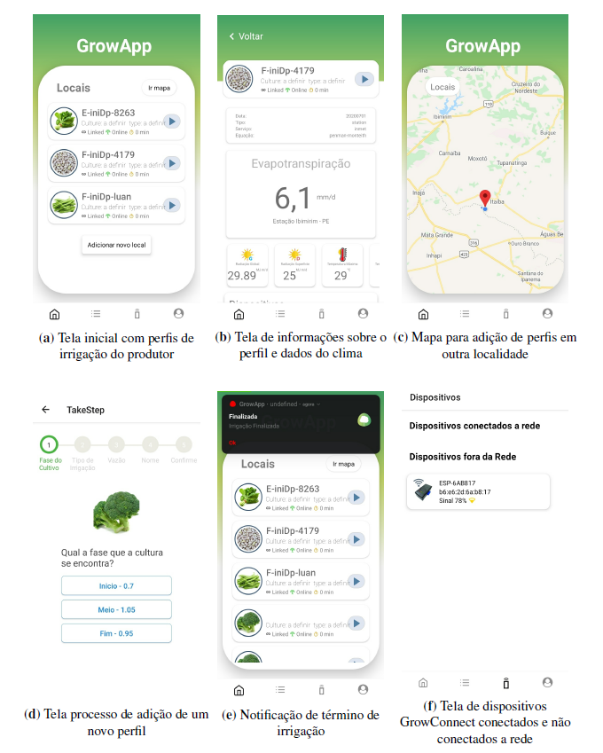
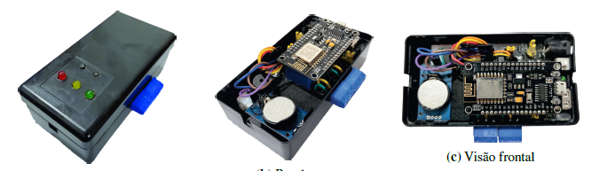
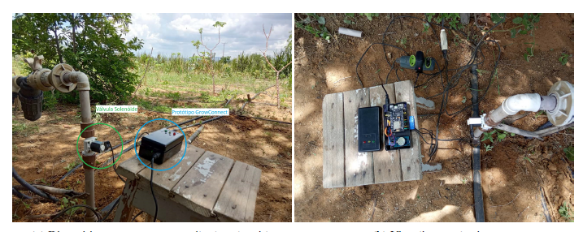

# GrowApp

O GrowApp é um aplicativo feito em react-native que tem acesso a [SIA API](https://github.com/luancsl/SIA) assim como o [EvApp](https://github.com/luancsl/EvApp)
para realizar suas funções, mas que foi projetado e desenvolvido para um perfil de usuário
menos técnico como, por exemplo, o produtor rural. Com ele o produtor pode de forma fácil e
barata gerenciar melhor seus recursos hídricos utilizado no seu sistema de irrigação de modo a
economizar água e obter uma melhor produção em regiões de escassez. Diferente do EvApp, o   GrowApp também tem acesso a dados de diversas culturas e consegue calcular a evapotranspiração   potencial com os dados da evapotranspiração de referência para o local e o coeficiente de cultivo (Kc)   da planta escolhida.

Através da internet o produtor consegue realizar o download dos dados de clima para
a região escolhida, assim como a ETo calculada e depois escolher a cultura para qual esteja
trabalhando, sua fase de desenvolvimento e categoria de irrigação. Após a configuração dos
parâmetros iniciais é dado ao produtor um perfil(espaço) identificado pelas características locais
e informações da cultura inseridas anteriormente, este perfil é de controle da irrigação, indicando
ao produtor a quantidade de tempo necessário que ele deve deixar seu sistema de irrigação ligado
para que seja cumprido a reposição do déficit hídrico exigido pela planta no dia.

Entre as principais funcionalidades, estão:
1. Notificação push, ao término do tempo de cada perfil.
2. Loja de culturas, onde é possível visualizar dados sobre as culturas disponíveis para
inserção.
3. Escolha de local no mapa para configuração de perfil, sem a necessidade de está no
local da irrigação.
4. Conexão e sincronização com dispositivo GrowConnect de irrigação automatizada.

